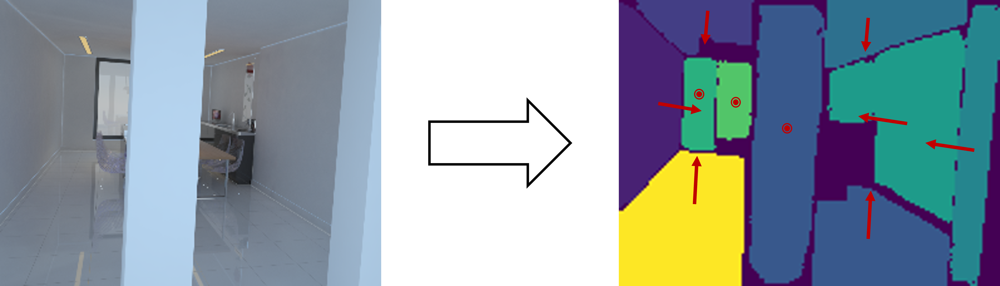
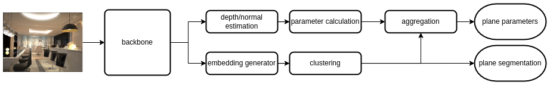
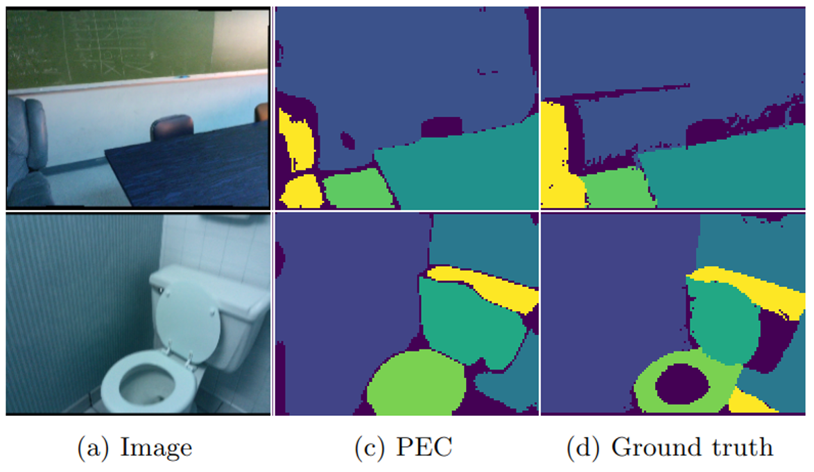
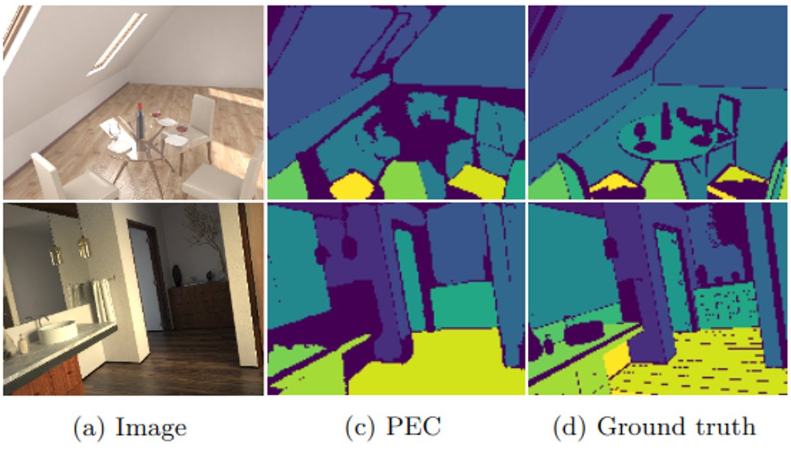

# Plane Estimation with Clustering - PEC

## Short Summary

The goal is to create a model which can detect planes and their
parameters from a single image. To achieve this goal, a deep neural network is
used which predicts the depth, surface normal and an embedding vector per pixel.
From the depth and surface normal, the plane parameter for each pixel can be
calculated, and with HDBSCAN as a clustering method the plane segmentation can
be computed out of the embedding vectors. Over the segmented planes RANSAC
is used to improve the plane parameters as it removes outliers.

A single image is transformed into a plane segmentation and plane parameters represented by red arrows.

The following image shows the flowchart of the complete PEC pipeline. The images pass from
left to right through the neural network, calculation, clustering and aggregation to
return the plane segmentation and parameters

## Results

### SCANNet

### Hypersim

## Running

To train the network just run the train.py file in the Training folder. All settings regarding the training must be set
in the settings.py file. The network can be trained using the SCANNet or Hypersim Dataset and for both an example 
settings file is provided.

The evaluation of the trained network can be run in the Evaluation folder.

The demo.py file runs an example Hypersim image. For it to work you have to download the Hypersim-Model from the link
below and put it in the same Folder.

### Pretrained Networks

Hypersim-Model: https://1drv.ms/u/s!AsMqNkYHpxWag5UF4Mm9S8at7LMlTg?e=NhzmKy

SCANNet-Model: https://1drv.ms/u/s!AsMqNkYHpxWag5UGdwRGKtfk7a9prA?e=S528NF

